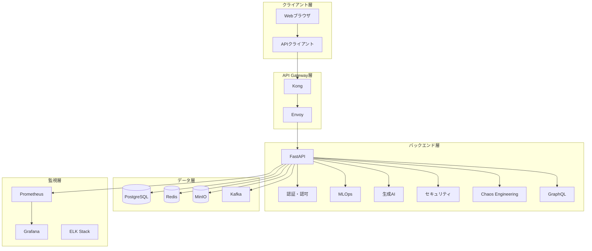
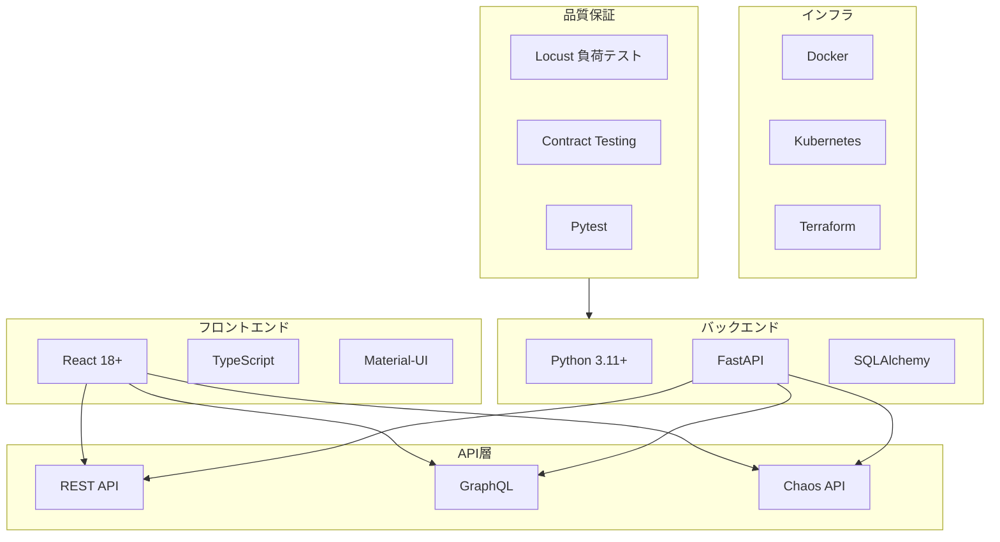
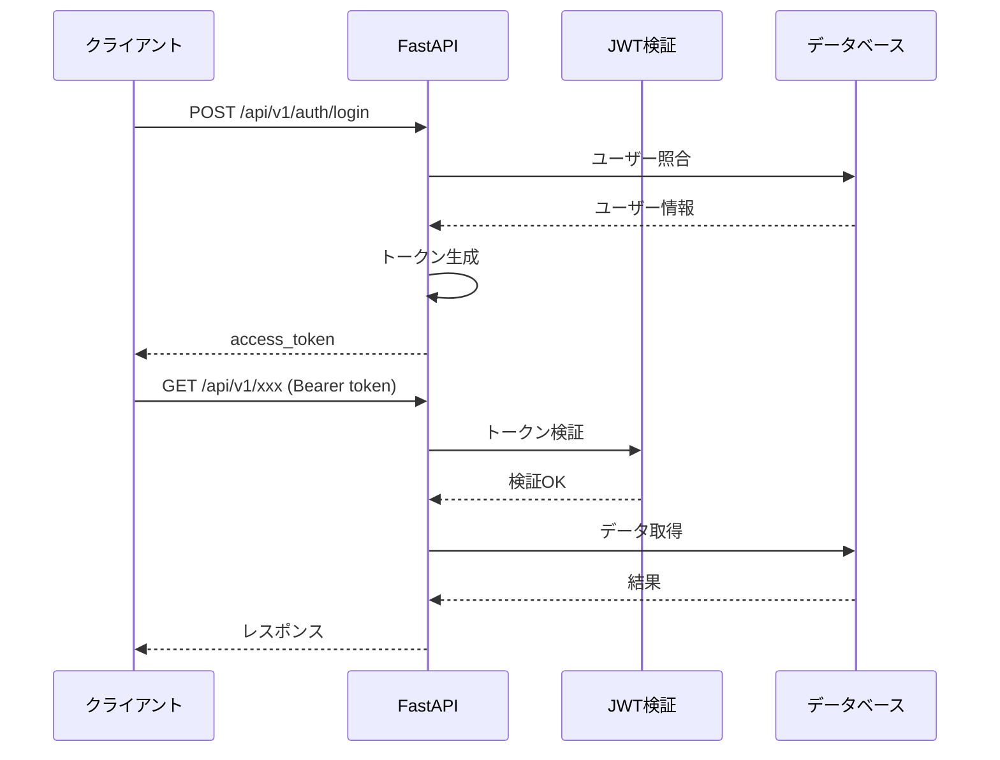

# UEP v5.0 アーキテクチャ図

**作成日**: 2026年2月  
**対象**: 次世代エンタープライズ統合プラットフォーム v5.0

---

## 1. システム全体構成



---

## 2. レベル別アーキテクチャ

```mermaid
flowchart LR
    subgraph L1["Level 1: コア"]
        MLOps[MLOps]
        GenAI[生成AI]
        Sec[セキュリティ]
        Cloud[クラウドインフラ]
        IDOP[IDOP]
        AIDev[AI支援開発]
        Monitor[監視]
    end

    subgraph L2["Level 2: プラットフォーム"]
        SaaS[SaaS]
        Marketplace[APIマーケットプレイス]
    end

    subgraph L3["Level 3: エコシステム"]
        Partner[パートナー統合]
        ModelShare[モデル共有]
    end

    subgraph L4["Level 4: インダストリー"]
        InferenceAI[推論AI]
        MCP[MCP/A2A]
        Gov[ガバナンス]
    end

    subgraph L5["Level 5: グローバル"]
        MultiRegion[マルチリージョン]
        HA[高可用性]
        DR[災害復旧]
    end

    L1 --> L2 --> L3 --> L4 --> L5
```



---

## 3. 技術スタック構成



---

## 4. データフロー（認証）



---

## 5. Chaos Engineering フロー

```mermaid
flowchart LR
    UI[Chaos UI] -->|遅延注入| API[/api/v1/chaos/delay]
    UI -->|エラー注入| API2[/api/v1/chaos/error]
    UI -->|混合| API3[/api/v1/chaos/mixed]
    API --> Backend[FastAPI]
    API2 --> Backend
    API3 --> Backend
    Backend -->|asyncio.sleep| Delay[遅延]
    Backend -->|HTTPException| Error[エラー]
```

---

## 6. ファイル構成（主要）

| ディレクトリ | 説明 |
|-------------|------|
| `backend/` | FastAPI バックエンド |
| `backend/chaos/` | Chaos Engineering モジュール |
| `backend/graphql_api/` | GraphQL モジュール |
| `backend/tests/contract/` | Contract Testing |
| `frontend/` | React フロントエンド |
| `frontend/src/components/Chaos/` | Chaos UI |
| `infrastructure/` | インフラ設定 |
| `scripts/` | ユーティリティスクリプト |

---

以上
